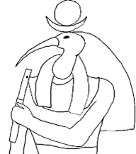
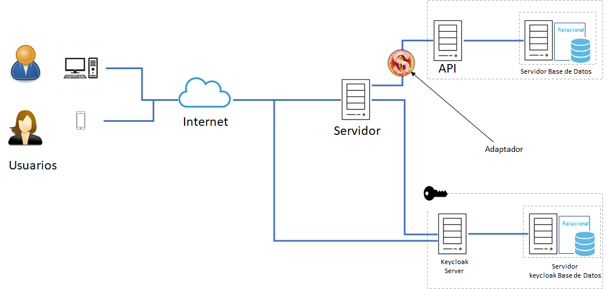

# Thot
  <center></center>
  <center><strong>Administardor de Servicios</strong> </center>   

*******    


Thot en la mitología _Egipcia_ está considerado dios de la sabiduría y tenía autoridad sobre todos los dioses. También fue el inventor de la escritura, patrón de los escribas, de las artes y las ciencias. Como dios de la escritura, era el inventor de todas las palabras, del lenguaje articulado.

Era un dios lunar medidor del tiempo, y el que estableció el primer calendario y por eso el primer mes llevaba su nombre.

Thot desempeña el oficio de escribano sagrado, ya que documenta los hechos en la sala de las Dos Verdades. Es el registrador y el juez.

También fue considerado el arquitecto que conocía los trazados y trayectorias de todas las cosas, el señor de los inventores y de la sabiduría.  


# Descripción General del Sistema

**THOT** sistema de gestión de servicios (guardias), tanto en una organización jerarquizada (Policías, Militares, etc) como no (médicos, fontaneros, etc) y tanto para personas como para objetos o lugares (quirofanos, vehículos, servidores etc).  
Se desarrollará una solución que automatice lo procesos de nombramiento de servicos evitando arbitrariedades y que tenga en cuenta las posibles exclusiones(efermedades, vacaciones, averias etc) de los que realizan el servico, notificando (vía email) el día que el personal nombrado o el encargado del material  debe realizar el servicio, ya sea el titular (el que realiza la guardia) o el imaginaria (reserva del titular).
 


El modelo  desarrollo por Capas,  el objetivo primordial es la separación (desacoplamiento) de las partes que componen un sistema software: lógica de negocios, capa de presentación y capa de datos.


Capa de presentación: es la que ve el usuario, presentando el sistema al usuario, le comunica la información y captura la información del usuario en un mínimo de proceso (realiza un filtrado previo para comprobar que no hay errores de formato). Debe ser «amigable» (entendible y fácil de usar) para el usuario. Esta capa se comunica únicamente con la capa de negocio. Para ello, se emplea Angular (HTML-JavaScript-TypeScript). En esta capa, se pretende implantar el término HATEOAS (Hypermedia as the engine of applicacion state - hipermedia como el motor del estado de la aplicación). Se puede afirmar que es una de las propiedades más significativas de REST: HATEOAS postula que el cliente pueda moverse por la aplicación web únicamente siguiendo a los identificadores únicos URI en formato hipermedia. Cuando se aplica este principio, el cliente, aparte de una comprensión básica de los hipermedia, no necesita más información para poder interactuar con la aplicación y el servidor. Estos URI se presentan, bien en forma de atributos href y src si hacen referencia a documentos HTML, o bien, con elementos o atributos JSON o XML que los clientes pueden reconocer de forma automática.
La aplicación de este principio HATEOAS permite que la interfaz de un servicio REST pueda modificarse siempre que se requiera, lo que constituye una ventaja fundamental de esta arquitectura frente a otras,como las basadas en SOAP (Simple Object Access Protocol).

Capa de negocio: aquí residen los programas que se ejecutan, se reciben las peticiones del usuario y se envían las respuestas tras el proceso. En esta capa se establecen todas las reglas que deben cumplirse. Esta capa se comunica con la capa de presentación, para recibir las solicitudes y presentar los resultados, y con la capa de datos, para solicitar al gestor de base de datos almacenar o recuperar datos de él. En nuestro caso, al igual que en la capa de presentación, se va a emplear el lenguaje de programación Java y framework Spring.

Capa de datos: es donde residen los datos y es la encargada de acceder a los mismos. Está formada por uno o más gestores de bases de datos que realizan todo el almacenamiento de datos, reciben solicitudes de almacenamiento o recuperación de información desde la capa de negocio. Para desarrollo se utiliza H2.

Para securizar el backend (API-REST) y el frontend se va autilizar [keycloak](https://www.keycloak.org/) y los adaptadores:  
  -  [Sauron-backend](https://github.com/PRACTICA-DIM/libreriaSauron-Backend)  
  -  [Sauron-Frontend](https://github.com/PRACTICA-DIM/libreriaSauron-Frontend)

# Arquitectura

  


# _application.properties_  
```json  
        #BASE DE DATOS
        spring.datasource.url=jdbc:h2:tcp://localhost/~/thot
        spring.datasource.username=thot
        spring.datasource.password=thot
        spring.datasource.driver-class-name=org.h2.Driver
        spring.jpa.hibernate.ddl-auto=create-drop
        #create-drop, create, update
        logging.level.org.hibernate.SQL=debug
        logging.level.org.springframework.web=DEBUG

        #API REST
        server.port=8099
        spring.data.rest.detection-strategy=annotated
        server.servlet.contextPath=/thot


        #DESARROLLO
        spring.devtools.livereload.enabled=true
        spring.devtools.restart.poll-interval=2s
        spring.devtools.restart.quiet-period=1s
```  

#  DIAGRAMAS  

-  [Casos de Uso](https://viewer.diagrams.net/?highlight=0000ff&edit=_blank&layers=1&nav=1&title=CASOS%20DE%20USO.drawio#Uhttps%3A%2F%2Fraw.githubusercontent.com%2Fkzurro%2FThot-docs%2Fmain%2FCASOS%2520DE%2520USO.drawio)  
-  [Clases de diseño](https://viewer.diagrams.net/?highlight=0000ff&edit=_blank&layers=1&nav=1&title=Thot.drawio#Uhttps%3A%2F%2Fraw.githubusercontent.com%2Fkzurro%2FThot-docs%2Fmain%2FThot.drawio)